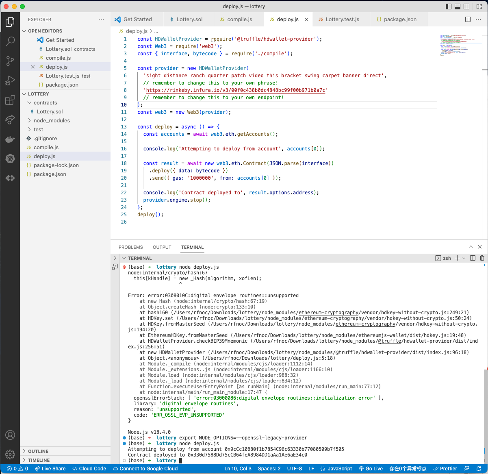

#   85. Completed Boilerplate - Do Not Skip

In the next lecture, we will be copying the project Inbox project and modifying it to use with our new Lottery project.

**We have provided a boilerplate that you can use to avoid version issues or conflicts**. Download the boilerplate attached to this lecture to where you typically develop and run ```npm install```.

<details>
  <summary>Completed Boilerplate</summary>

##  Environment Setup

Due to expected dependency conflicts with old installed versions, it would be best to create a brand new project.

In your terminal of choice, run the following:

1.  ```mkdir lottery```
1.  ```cd lottery```
1.  ```npm init -y```
1.  ```npm install solc@0.4.17 web3 mocha ganache-cli @truffle/hdwallet-provider```
1.  Update your test script in the package.json file to be ```"test": "mocha"```
1.  Copy your contracts directory (containing Lottery.sol), test directory (containing Lottery.test.js), compile.js, and deploy.js into the new lottery project directory.

Here is the package.json file for reference (your versions should not be lower than those specified below):

```
{
  "name": "lottery",
  "version": "1.0.0",
  "description": "",
  "main": "index.js",
  "scripts": {
    "test": "mocha"
  },
  "author": "",
  "license": "ISC",
  "dependencies": {
    "@truffle/hdwallet-provider": "^1.5.1",
    "ganache-cli": "^6.12.2",
    "mocha": "^9.1.2",
    "solc": "^0.4.17",
    "web3": "^1.6.0"
  }
}
```

`Lottery.sol`
```
pragma solidity ^0.4.17;

contract Lottery {
    address public manager;
    address[] public players;
    
    function Lottery() public {
        manager = msg.sender;
    }
    
    function enter() public payable {
        require(msg.value > .01 ether);
        players.push(msg.sender);
    }
    
    function random() private view returns (uint) {
        return uint(keccak256(block.difficulty, now, players));
    }
    
    function pickWinner() public restricted {
        uint index = random() % players.length;
        players[index].transfer(this.balance);
        players = new address[](0);
    }
    
    modifier restricted() {
        require(msg.sender == manager);
        _;
    }
    
    function getPlayers() public view returns (address[]) {
        return players;
    }
}   
```

**compile.js**
```
const path = require("path");
const fs = require("fs");
const solc = require("solc");

const lotteryPath = path.resolve(__dirname, "contracts", "Lottery.sol");
const source = fs.readFileSync(lotteryPath, "utf8");

module.exports = solc.compile(source, 1).contracts[":Lottery"];
```

**Lottery.test.js**

```

```

**deploy.js**

```
const HDWalletProvider = require('@truffle/hdwallet-provider');
const Web3 = require('web3');
const { interface, bytecode } = require('./compile');

const provider = new HDWalletProvider(
  'remember to change this to your own phrase!',
  // remember to change this to your own phrase!
  'https://rinkeby.infura.io/v3/00f0c438b0dc4848bc99f00b971b0a7c'
  // remember to change this to your own endpoint!
);
const web3 = new Web3(provider);

const deploy = async () => {
  const accounts = await web3.eth.getAccounts();

  console.log('Attempting to deploy from account', accounts[0]);

  const result = await new web3.eth.Contract(JSON.parse(interface))
    .deploy({ data: bytecode })
    .send({ gas: '1000000', from: accounts[0] });

  console.log('Contract deployed to', result.options.address);
  provider.engine.stop();
};
deploy();
```
</details>  

<details>
  <summary>Deployment to Rinkeby - result</summary>
  
- [Error message "error:0308010C:digital envelope routines::unsupported"](https://stackoverflow.com/questions/69692842/error-message-error0308010cdigital-envelope-routinesunsupported)
---

---
</details>  

##  Resources for this lecture

---

-   [lottery-boilerplate.zip](https://github.com/web3-nfts/bt-web3/raw/main/Curricula/Ethereum-and-Solidity_The_Complete_Developers_Guide/resources/lottery-boilerplate.zip)