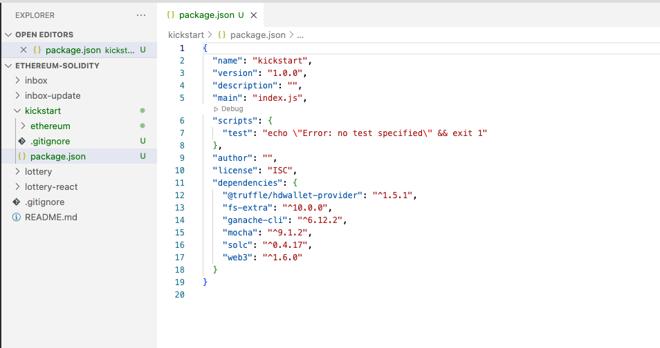

#   How to setup project - Kickstart

##  initialize Project - Kickstart
-   `mkdir kickstart`
-   `cd kickstart`
-   `npm init`

##  Installing Modules

**install ganache-cli mocha solc@0.4.17 fs-extra web3 @truffle/hdwallet-provider** 
```
npm install ganache-cli mocha solc@0.4.17 fs-extra web3 @truffle/hdwallet-provider
```
<details>
  <summary>Installing Modules - result</summary>


---
</details>  

## **create a Campaign.sol**
<details>
  <summary>Campaign.sol</summary>

```
pragma solidity ^0.4.17;

contract CampaignFactory {
    address[] public deployedCampaigns;

    function createCampaign(uint minimum) public {
        address newCampaign = new Campaign(minimum, msg.sender);
        deployedCampaigns.push(newCampaign);
    }

    function getDeployedCampaigns() public view returns (address[]) {
        return deployedCampaigns;
    }
}

contract Campaign {
    struct Request {
        string description;
        uint value;
        address recipient;
        bool complete;
        uint approvalCount;
        mapping(address => bool) approvals;
    }

    Request[] public requests;
    address public manager;
    uint public minimumContribution;
    mapping(address => bool) public approvers;
    uint public approversCount;

    modifier restricted() {
        require(msg.sender == manager);
        _;
    }

    function Campaign(uint minimum, address creator) public {
        manager = creator;
        minimumContribution = minimum;
    }

    function contribute() public payable {
        require(msg.value > minimumContribution);

        approvers[msg.sender] = true;
        approversCount++;
    }

    function createRequest(string description, uint value, address recipient) public restricted {
        Request memory newRequest = Request({
           description: description,
           value: value,
           recipient: recipient,
           complete: false,
           approvalCount: 0
        });

        requests.push(newRequest);
    }

    function approveRequest(uint index) public {
        Request storage request = requests[index];

        require(approvers[msg.sender]);
        require(!request.approvals[msg.sender]);

        request.approvals[msg.sender] = true;
        request.approvalCount++;
    }

    function finalizeRequest(uint index) public restricted {
        Request storage request = requests[index];

        require(request.approvalCount > (approversCount / 2));
        require(!request.complete);

        request.recipient.transfer(request.value);
        request.complete = true;
    }
}
```
</details>  
 
## **create compile.js**
-   `compile.js`
    ```
    const path = require("path");
    const fs = require("fs");
    const solc = require("solc");

    const inboxPath = path.resolve(__dirname, "contracts", "Inbox.sol");
    const source = fs.readFileSync(inboxPath, "utf8");

    //  console.log(solc.compile(source, 1));
    module.exports = solc.compile(source, 1).contracts[':Inbox'];
    ```

##  run `node compile.js`

-   in terminal run `node compile.js`

<details>
  <summary>compile - issues</summary>

In the upcoming lecture, we will be logging the compilation of our script to the terminal. If you are using **solc 0.4.17** as shown in the course, you may get these warnings:

*Invalid asm.js: Invalid member of stdlib*

or

*':6:5: Warning: Defining constructors as functions with the same name as the contract is deprecated. Use "constructor(...) { ... }" instead.\n' +*

'    function Inbox(string initialMessage) public {\n' +

'    ^ (Relevant source part starts here and spans across multiple lines).\n'

**These specific warnings can be ignored as they will not cause any issues with the compilation or deployment of the contract we are building.**
</details>  

## **create kickstart.test.js**
-   `kickstart.test.js`
    ```
    
    ```
###  Testing with Mocha 

-   change the `package.json`
    ```
    "scripts": {
        "test": "echo \"Error: no test specified\" && exit 1"
    }
    ```
    to
    ```
    "scripts": {
        "test": "mocha"
    }
    ```
-   run Mocha test 
    ```
    npm run test
    ```
<details>
  <summary>If the following Error: 0308010C:digital envelope routines::unsupported</summary>

    ```
    Error: error:0308010C:digital envelope routines::unsupported
        at new Hash (node:internal/crypto/hash:67:19)
        at Object.createHash (node:crypto:130:10)
        at module.exports (/Users/user/Programming Documents/WebServer/untitled/node_modules/webpack/lib/util/createHash.js:135:53)
        at NormalModule._initBuildHash (/Users/user/Programming Documents/WebServer/untitled/node_modules/webpack/lib/NormalModule.js:417:16)
        at handleParseError (/Users/user/Programming Documents/WebServer/untitled/node_modules/webpack/lib/NormalModule.js:471:10)
        at /Users/user/Programming Documents/WebServer/untitled/node_modules/webpack/lib/NormalModule.js:503:5
        at /Users/user/Programming Documents/WebServer/untitled/node_modules/webpack/lib/NormalModule.js:358:12
        at /Users/user/Programming Documents/WebServer/untitled/node_modules/loader-runner/lib/LoaderRunner.js:373:3
        at iterateNormalLoaders (/Users/user/Programming Documents/WebServer/untitled/node_modules/loader-runner/lib/LoaderRunner.js:214:10)
        at iterateNormalLoaders (/Users/user/Programming Documents/WebServer/untitled/node_modules/loader-runner/lib/LoaderRunner.js:221:10)
    /Users/user/Programming Documents/WebServer/untitled/node_modules/react-scripts/scripts/start.js:19
    throw err;
    ^
    ```

**Open terminal and paste these as described :**

-   Linux & Mac OS (windows git bash)-
    ```
    export NODE_OPTIONS=--openssl-legacy-provider
    ```

- [Error message "error:0308010C:digital envelope routines::unsupported"](https://stackoverflow.com/questions/69692842/error-message-error0308010cdigital-envelope-routinesunsupported)
</details> 

## **Infura Signup**

-   [infura.io](https://infura.io/)

##  **Wallet Provider Setup**

-   Wallet Provider Setup
    ```
    npm install @truffle/hdwallet-provider
    ```
## **Create deploy.js** 
-   `deploy.js`
    ```
    const HDWalletProvider = require('@truffle/hdwallet-provider');
    const Web3 = require('web3');
    const { interface, bytecode } = require('./compile');

    const provider = new HDWalletProvider(
        'REPLACE_WITH_YOUR_MNEMONIC',
        // remember to change this to your own phrase!
        'https://rinkeby.infura.io/v3/15c1d32581894b88a92d8d9e519e476c'
        // remember to change this to your own endpoint!
    );
    const web3 = new Web3(provider);

    const deploy = async () => {
        const accounts = await web3.eth.getAccounts();

        console.log('Attempting to deploy from account', accounts[0]);

        const result = await new web3.eth.Contract(JSON.parse(interface))
            .deploy({ data: bytecode, arguments: ['Hi there!'] })
            .send({ gas: '1000000', from: accounts[0] });

        console.log('Contract deployed to', result.options.address);
        provider.engine.stop();
    };
    deploy();
    ```

###  Deployment to Rinkeby 

-   Deployment to Rinkeby 
    ```
    node deploy.js
    ```